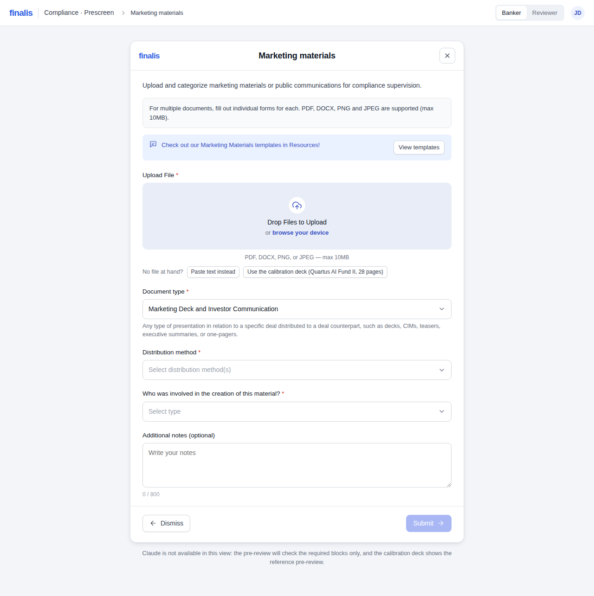
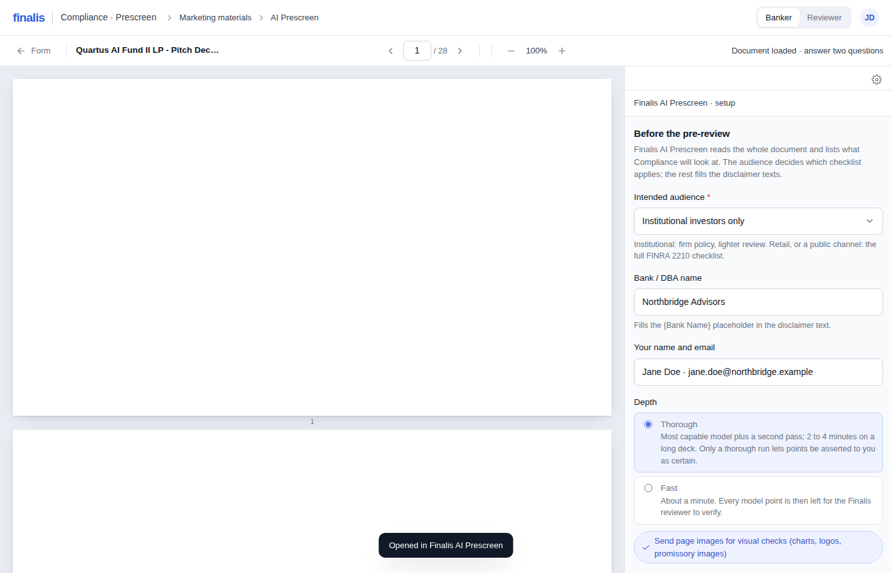
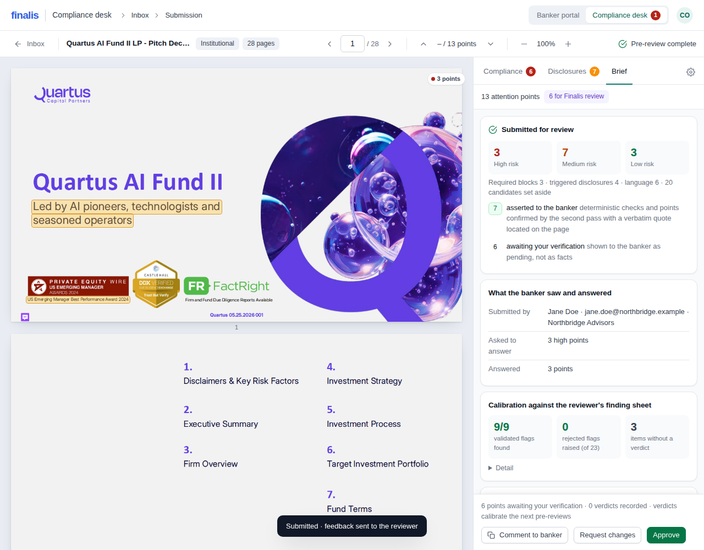
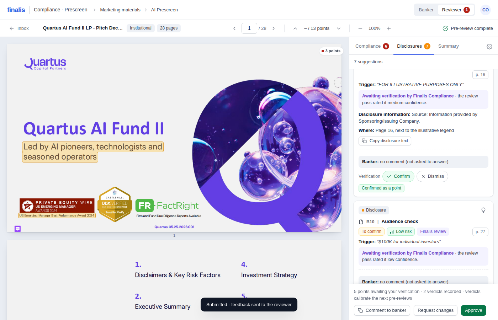

# Finalis AI Prescreen

A mandatory AI pre-review that sits under the **Marketing materials** upload form: the banker fills the
usual form, presses **Submit**, and instead of the document going straight to Compliance it opens in the
Finalis AI Prescreen. The pre-review reads the whole document, checks the SOP disclosure blocks verbatim,
maps what the disclaimers already cover, reviews the wording under FINRA Rule 2210, and sends Compliance a
brief with the attention points, the banker's answers, and a short list of items for the reviewer to verify.



Everything runs locally: one Python file serves the page and calls Claude **through your own Claude Code
login**. No API key, no install beyond Python and Claude Code, nothing leaves your machine except the
document text sent to Claude under your own account.

---

## 1. What you need

| | |
|---|---|
| **Python 3.8+** | `python3 --version` — macOS and Linux already have it; Windows: https://www.python.org/downloads/ (tick "Add python.exe to PATH") |
| **Claude Code** | `npm install -g @anthropic-ai/claude-code`, then run `claude` once and sign in with your Claude account |

Nothing else. No pip install, no node_modules, no Docker.

## 2. Install and run

```bash
git clone https://github.com/Baptiste6913/Finalis.git
cd Finalis
./run.sh            # Windows: run.cmd
```

Then open **http://127.0.0.1:8787/**

On start the server tells you exactly how it will reach Claude:

```
  Finalis AI Prescreen
  backend : cli
            Claude through your own Claude Code login (the `claude` CLI). No API key needed;
            the calls are billed to your Claude account. Text only: no page images.
  models  : complex=claude-opus-5, default=claude-sonnet-5, quick=claude-haiku-4-5-20251001

  Open http://127.0.0.1:8787/  (Ctrl+C to stop)
```

## 3. How the AI connects to your Claude account

The server picks a backend by itself, in this order:

1. **`ANTHROPIC_API_KEY` is set** (in your shell or in a `.env` file next to `server.py`) → the Anthropic
   API. This is the only mode that also sends page images to the model, which helps on charts and logos.
2. **The `claude` CLI is on your PATH** → every model call runs through Claude Code with *your* login.
   This is the default and the reason there is nothing to configure: if `claude` works in your terminal,
   the pre-review works. Usage is billed to your Claude plan.
3. **Neither** → mock mode: the page still opens and replays a reference pre-review of the sample deck, so
   you can click through the product without any model.

To force one of them: `PRESCREEN_BACKEND=cli|api|mock ./run.sh`. See `.env.example` for the rest
(models, port). If your Claude account cannot use `claude-opus-5`, set `MODEL_COMPLEX` and `MODEL_DEFAULT`
in `.env` to models you do have — the server also retries automatically with your account's default model.

## 4. Try it in three minutes

1. Open http://127.0.0.1:8787/ . You get the Marketing materials modal, identical to the platform's.
2. Click **Use the calibration deck (Quartus AI Fund II, 28 pages)** under the upload box (or drop your
   own PDF, DOCX, PNG or JPEG).
3. Distribution method → *Email*. Who was involved → *Banker*. **Submit**.
4. You land in the AI Prescreen. Intended audience → *Institutional investors only*, depth **Thorough**,
   **Start the pre-review**. It takes 2 to 5 minutes on a 28-page deck and streams its progress.
5. Read the three tabs on the right: **Compliance** (wording), **Disclosures** (missing blocks and
   triggered disclosures), **Summary** (your document in two lines, the points Compliance will ask you to
   answer, and what happens when you submit). Click any point to jump to the exact highlighted passage;
   press `j` / `k` to walk the points.
6. Answer the high points, tick the acknowledgement, **Complete submission**. That is the whole banker side.
   **Export this summary as PDF** (Summary tab, and again on the confirmation page) gives the banker a record of
   what was asked and answered; the desk has its own **Export the full brief as PDF** and a PDF button per
   submission in the inbox. The PDFs are generated in the page, no library, nothing sent anywhere.
7. Switch to the **Compliance desk** (top right) to see the same submission as Compliance receives it: the
   full brief, what the deck already covers, the gut check, the banker's answers, the ready-to-send feedback,
   a verdict per asserted point and Confirm / Dismiss on each pending one.

The banker portal and the Compliance desk are two separate applications. This demo page hosts both behind
one switch so you can play both roles; the accent colour, the header and the tabs change with the side you
are on, and nothing reaches the desk before the banker submits.






## 5. What is asserted, and what waits for a human

The point of this build: the banker is never told something the machine is not sure of.

A point is **asserted** only when it is deterministic (an SOP block matched verbatim on the text layer) or
when the model's point survives every check: the quoted passage is located word-for-word on the page, the
findings pass rated it high confidence, the second pass kept it unchanged, and an independent signal
corroborates it (the SOP wording is genuinely absent from the document, or the quote contains a term from
the desk's language guide).

Everything else appears under **For Finalis review**: shown to the banker as pending, never as a fact, with
the reason it was not asserted, and never blocking the submission. The reviewer gets **Confirm** /
**Dismiss** on each of those, and the feedback email lists them first.



## 6. It learns from the desk

Every reviewer verdict is stored as a structured precedent (rule, lane, document type, page, quote,
correct/incorrect, reason). On the next pre-review the closest precedents are injected into the prompts,
repeated rejections of the same rule are distilled by Claude into new calibration rules, and a rule the
desk keeps rejecting is demoted or set aside automatically. The **Learning** view (Compliance desk) shows the
track record per rule and exports the whole state as JSON.

## 7. Speed, cost, and what it costs you

A thorough pre-review is three model calls (map the document → apply the rulebook → senior second pass).
On the corpus used for the simulations: **2 to 5 minutes** and **$0.32 to $0.82** of model usage per
document, billed to whichever Claude account the backend uses. The **Fast** depth is about a minute and
one call, and then nothing is asserted to the banker without the reviewer.

## 8. Does it actually work better than the old overlay?

`docs/SIMULATIONS.md` is the full report: both engines run on the same documents, scored against a written
ground truth, with the method, the per-document detail, and the honest limits. Headline, same corpus, real
models:

| | old overlay engine | this product |
|---|---|---|
| Reviewer points found (7-document corpus) | 22 / 31 | **31 / 31** |
| Points raised that the ground truth forbids | 26 (of 84 raised) | **2 (of 46)** |
| Calibration deck vs the reviewer's finding sheet | 5/9 validated flags, 10/23 rejected flags raised, 63 points | **8/9 validated, 0 rejected flags asserted, 11 points** |
| Quoted passages located verbatim for highlighting | n/a | **46 / 46** |

Reproduce it yourself (this spends model usage on your account):

```bash
python3 sim/corpus.py       # regenerate the synthetic corpus + ground truth
python3 sim/old_engine.py   # baseline: the overlay's engine, unchanged
python3 sim/run_new.py      # this product, real models, through the product path
python3 sim/score.py && python3 sim/report.py
```

## 9. What is in this repo

```
run.sh / run.cmd     start the local server
server.py            the whole backend: static files, Claude calls, document store, assets, learning
shell.html, src/*.js the app (one page, no framework, no build step beyond build.py)
build.py             assembles shell.html + src/*.js into dist/ and web/
web/index.html       the local build served by server.py        (generated)
dist/prescreen.html  the same app as a standalone claude.ai artifact page (generated)
quartus.pdf          the calibration deck used by the demo button
brand/               drop the official Finalis logo here as logo.svg, then re-run build.py
docs/                SIMULATIONS.md (the evaluation), ARCHITECTURE.md (the rule pipeline), screens/
sim/                 the simulation corpus, the old engine, the runner, the scorer, the report
tests/               Playwright flows (see below)
data/                created at first run: submissions, uploaded PDFs, learning state (gitignored)
```

After editing `shell.html` or anything in `src/`, run `python3 build.py` and refresh the page.

## 10. Tests

```bash
pip install playwright && python -m playwright install chromium
python3 tests/test_local.py   # the local build against server.py in mock mode, end to end
python3 tests/test_flow.py    # banker → reviewer → learning, with a stubbed Claude, scored against the finding sheet
python3 tests/test_hl.py      # highlight location on 18 real quotes from the calibration deck
```

None of these call a model.

## 11. Troubleshooting

**"running in mock mode"** — the server found neither `ANTHROPIC_API_KEY` nor the `claude` CLI. Install
Claude Code, run `claude` once to sign in, restart `./run.sh`.

**"claude CLI failed: ... not logged in"** — run `claude` in a terminal, `/login`, then retry.

**"This Claude account may not have access to claude-opus-5"** — set `MODEL_COMPLEX` and `MODEL_DEFAULT`
in `.env` to models your plan includes.

**Port 8787 already in use** — `PRESCREEN_PORT=8899 ./run.sh`.

**The page says "Claude is not available in this view"** — that is the artifact build (`dist/prescreen.html`)
opened as a plain file. Use the local server, or publish that file as a Claude artifact.

**A scanned PDF with no text layer** — upload it as PNG/JPEG instead: the pre-review transcribes the image
first (API backend only).

## 12. Privacy

The document never leaves your machine except as text (and, on the API backend, page images) inside the
model call made under your own account. Submissions, the uploaded PDFs and the learning state live in
`data/` next to the code; delete the folder and nothing remains. The server binds to 127.0.0.1 by default.

---

Built for the Finalis AI hackathon. The rulebook quotes the Finalis Disclaimer SOP, the Language Guide and
the interim Institutional MMAT Review Framework verbatim; the calibration rules encode a Finalis reviewer's
own verdicts on the Quartus deck. It is advisory: it is not an approval and it changes no status.
